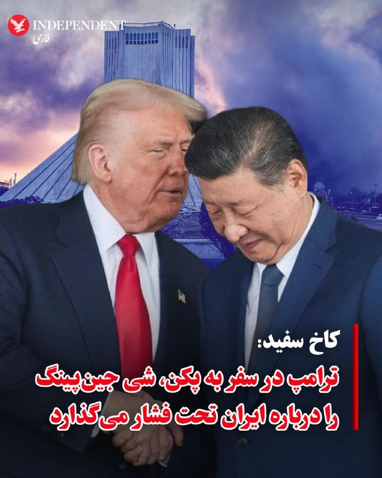
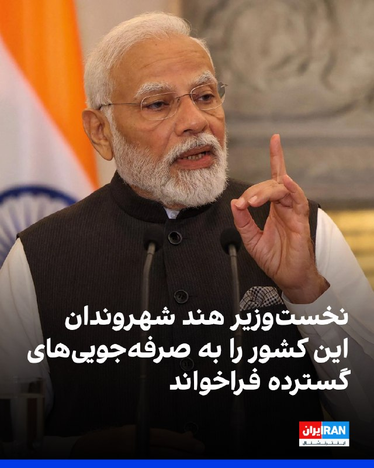
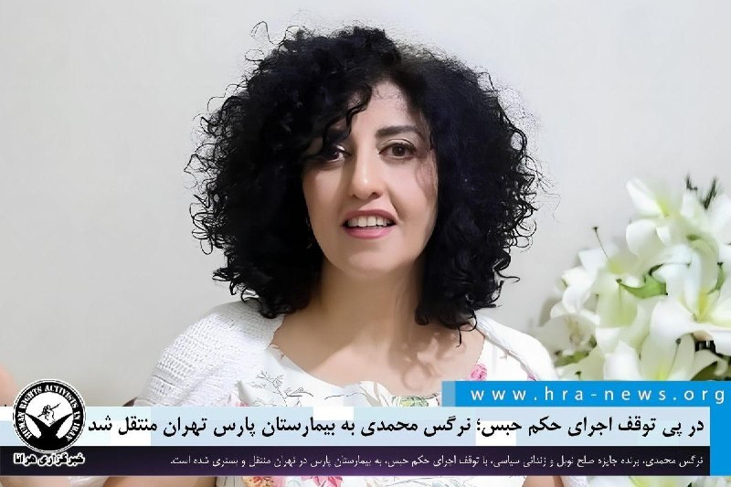

# خواننده تلگرام

<!-- TOP_NAV START -->

<!-- TOP_NAV END -->

<!-- MSG START -->

---
📅 بروزرسانی: 1405/02/20 23:12
---

## VahidOOnLine — post 239376

  

♦️آنا کلی، معاون سخنگوی کاخ سفید، روز یکشنبه ۲۰ اردیبهشت، با اعلام آنکه دونالد ترامپ شامگاه چهارشنبه وارد پکن می‌شود، گفت رئیس‌جمهوری ایالات متحده، در سفر پیش‌روی خود به پکن، شی جین‌پینگ، رئیس‌جمهوری چین را درباره ایران تحت فشار قرار خواهد داد.
به گزارش خبرگزاری فرانسه، این مقام آمریکایی در گفتگو با خبرنگاران گفت: «انتظار دارم رئیس‌جمهوری درباره ایران فشار وارد کند.» او افزود ترامپ در تماس‌های پیشین خود با شی نیز بارها موضوع درآمدهای نفتی ایران و روسیه از فروش نفت به چین، و همچنین صادرات کالاهای دارای کاربرد دوگانه نظامی و غیرنظامی را مطرح کرده بود.
بر اساس اعلام کاخ سفید، تجارت، تعرفه‌ها و هوش مصنوعی نیز از محورهای اصلی سفر ترامپ به چین خواهد بود. ترامپ از روز چهارشنبه تا جمعه در پکن حضور خواهد داشت و قرار است از معبد تاریخی «تیان تان» یا «معبد بهشت» نیز بازدید کند.
سفر ترامپ به چین قرار بود در ماه مارس انجام شود اما به دلیل جنگ ایران به تعویق افتاده بود.
به گفته آنا کلی، مراسم استقبال رسمی و دیدار دوجانبه ترامپ و شی صبح پنجشنبه برگزار خواهد شد و پس از آن، ترامپ از معبد بهشت بازدید می‌کند. شام رسمی دولتی نیز عصر همان روز برگزار خواهد شد.
قرار است ترامپ و شی روز جمعه نیز در یک نشست کاری و ضیافت ناهار شرکت کنند و سپس رئیس‌جمهوری آمریکا به واشنگتن بازگردد.
کاخ سفید اعلام کرد محور اصلی این سفر «بازتنظیم روابط با چین و اولویت دادن به رفتار متقابل و انصاف برای بازگرداندن استقلال اقتصادی آمریکا» خواهد بود.
‌🇸🇦 Indypersian

🤖 @VahidOOnLine

## VahidOOnLine — post 239375

  

نارندرا مودی، نخست‌وزیر هند، یکشنبه از شهروندان این کشور خواست مجموعه‌ای از اقدامات از جمله صرفه‌جویی در مصرف سوخت، دورکاری و محدودیت در سفر و واردات را رعایت کنند، زیرا افزایش شدید قیمت جهانی انرژی فشار زیادی بر ذخایر ارزی این کشور وارد کرده است.

مودی گفت مردم باید اولویت را به بازگشت به دورکاری و جلسات آنلاین بدهند؛ رویکردی که در دوران همه‌گیری کووید-۱۹ به‌طور گسترده اتخاذ شده بود، و افزود این کار به هند کمک می‌کند سوخت کمتری مصرف کند.

او گفت: «در وضعیت کنونی، ما باید تاکید زیادی بر صرفه‌جویی در ارز خارجی داشته باشیم.»

مودی همچنین از مردم خواست از وسایل حمل‌ونقل عمومی مانند مترو استفاده کنند و در صورت امکان برای صرفه‌جویی در سوخت، به طور مشترک از خودروها استفاده کنند.

هند، سومین واردکننده و مصرف‌کننده بزرگ نفت در جهان، اواخر ماه گذشته اعلام کرد که هیچ برنامه‌ای برای افزایش قیمت گازوئیل و بنزین در جایگاه‌ها ندارد و با وجود افزایش جهانی قیمت‌ها، در میان کشورهایی باقی مانده که هنوز قیمت‌ها را افزایش نداده‌اند.

‌🏁 🇬🇧 IranintlTV

🤖 @VahidOOnLine

## VahidOOnLine — post 239374

  <a href="telegram/content/VahidOOnLine_239374_1778442162.mp4" target="_blank">🎬 Download video</a>

اسلو | نروژ؛ گردهمایی ایرانیان ـ گزارشگر یکشنبه ۲۰ اردیبهشت ۱۴۰۵
‌🏁 🇬🇧 ManotoTV

🤖 @VahidOOnLine

## VahidOOnLine — post 239373

  <a href="telegram/content/VahidOOnLine_239373_1778442164.mp4" target="_blank">🎬 Download video</a>

‌
مونیخ | آلمان؛ گردهمایی ایرانیان ـ گزارشگر یکشنبه ۲۰ اردیبهشت ۱۴۰۵
‌🏁 🇬🇧 ManotoTV

🤖 @VahidOOnLine

## VahidOOnLine — post 239372

  

به گزارش جروزالم پست، ارتش اسرائیل یکشنبه بیش از ۲۰ هدف زیرساختی «مرتبط با تروریسم» را در سراسر جنوب لبنان هدف قرار داد.

بر اساس اعلام ارتش اسرائیل، این اهداف شامل انبارهای تسلیحات، مقرها و سازه‌های نظامی‌ای بود که «تروریست‌های حزب‌الله از آنها عملیات انجام می‌دادند».
‌🏁 🇬🇧 IranintlTV

🤖 @VahidOOnLine

## WithYashar — post 10881

به گزارش وال‌استریت ژورنال، ایران با برچیدن تأسیسات هسته‌ای خود مخالفت کرده و به‌جای تعلیق ۲۰ ساله غنی‌سازی که آمریکا خواستار آن بوده، یک توقف کوتاه‌تر را پیشنهاد داده است.

ایران همچنین پیشنهاد داده بخشی از اورانیوم با غنای بالای خود را رقیق کند و بقیه را به یک کشور ثالث منتقل کند؛ با این تضمین که اگر مذاکرات شکست بخورد، این مواد دوباره به ایران بازگردانده شوند.

ایران همچنین خواستار پایان فوری درگیری‌ها و بازگشایی تدریجی تنگه هرمز شده است؛ همزمان با کاهش تدریجی محاصره آمریکا. طبق این پیشنهاد، مسائل هسته‌ای طی ۳۰ روز آینده مورد مذاکره قرار خواهند گرفت.
@withyashar

## WithYashar — post 10880

بر اساس گزارش کانال ۱۲ اسرائیل،تماس تلفنی بین نتانیاهو و ترامپ به پایان رسیده است.ظاهرا این مکالمه حدودا یک ساعت طول کشیده است.
@withyashar

## mwarmonitor — post 8850

  <a href="telegram/content/mwarmonitor_8850_1778442168.mp4" target="_blank">🎬 Download video</a>

«بی‌بی سفت بشین که دستپخت من حرف نداره، داریم میریم یه کتلتی بپزیم که کل دنیا بوشو بفهمن!» @mwarmonitor

## mwarmonitor — post 8849

🔴به گزارش i24NEWS، رئیس‌جمهور ترامپ و نخست‌وزیر نتانیاهو تا یک ساعت آینده با یکدیگر گفت‌وگو خواهند کرد. @mwarmonitor

## IranIntlTV — post 336526

  <a href="telegram/content/IranIntlTV_336526_1778442169.mp4" target="_blank">🎬 Download video</a>

ایرنا گزارش داد پاسخ جمهوری اسلامی به آخرین متن پیشنهادی آمریکا برای پایان جنگ به میانجی پاکستانی تحویل داده شده است.

همزمان دونالد ترامپ گفت اهداف دیگری نیز در ایران وجود دارد که ممکن است مورد حمله قرار بگیرند.

گفت‌وگو با شایان سمیعی، کارشناس امنیت ملی
@iranintltv

## IranIntlTV — post 336525

  

نارندرا مودی، نخست‌وزیر هند، یکشنبه از شهروندان این کشور خواست مجموعه‌ای از اقدامات از جمله صرفه‌جویی در مصرف سوخت، دورکاری و محدودیت در سفر و واردات را رعایت کنند، زیرا افزایش شدید قیمت جهانی انرژی فشار زیادی بر ذخایر ارزی این کشور وارد کرده است.

مودی گفت مردم باید اولویت را به بازگشت به دورکاری و جلسات آنلاین بدهند؛ رویکردی که در دوران همه‌گیری کووید-۱۹ به‌طور گسترده اتخاذ شده بود، و افزود این کار به هند کمک می‌کند سوخت کمتری مصرف کند.

او گفت: «در وضعیت کنونی، ما باید تاکید زیادی بر صرفه‌جویی در ارز خارجی داشته باشیم.»

مودی همچنین از مردم خواست از وسایل حمل‌ونقل عمومی مانند مترو استفاده کنند و در صورت امکان برای صرفه‌جویی در سوخت، به طور مشترک از خودروها استفاده کنند.

هند، سومین واردکننده و مصرف‌کننده بزرگ نفت در جهان، اواخر ماه گذشته اعلام کرد که هیچ برنامه‌ای برای افزایش قیمت گازوئیل و بنزین در جایگاه‌ها ندارد و با وجود افزایش جهانی قیمت‌ها، در میان کشورهایی باقی مانده که هنوز قیمت‌ها را افزایش نداده‌اند.

https://iranintl.com/202605107871

## IranIntlTV — post 336524

  

به گزارش جروزالم پست، ارتش اسرائیل یکشنبه بیش از ۲۰ هدف زیرساختی «مرتبط با تروریسم» را در سراسر جنوب لبنان هدف قرار داد.

بر اساس اعلام ارتش اسرائیل، این اهداف شامل انبارهای تسلیحات، مقرها و سازه‌های نظامی‌ای بود که «تروریست‌های حزب‌الله از آنها عملیات انجام می‌دادند».
https://iranintl.com/202605105180

## IranIntlTV — post 336523

  <a href="telegram/content/IranIntlTV_336523_1778442174.mp4" target="_blank">🎬 Download video</a>

چشم‌انداز با مهدی مهدوی‌آزاد: جنون نظامی تازه سپاه و مجتبی در خلیج فارس

نسخه کامل این قسمت را در یوتیوب ایران‌اینترنشنال تماشا کنید:

https://youtu.be/kYSw-f3E0vk
@iranintltv

## ManotoTV — post 105275

  <a href="telegram/content/ManotoTV_105275_1778442177.mp4" target="_blank">🎬 Download video</a>

اسلو | نروژ؛ گردهمایی ایرانیان ـ گزارشگر یکشنبه ۲۰ اردیبهشت ۱۴۰۵

## ManotoTV — post 105274

  <a href="telegram/content/ManotoTV_105274_1778442179.mp4" target="_blank">🎬 Download video</a>

‌
مونیخ | آلمان؛ گردهمایی ایرانیان ـ گزارشگر یکشنبه ۲۰ اردیبهشت ۱۴۰۵

## FarsiVOA — post 217370

🔺نرگس محمدی به بیمارستان پارس در تهران منتقل شد

◾️مصطفی نیلی، وکیل نرگس محمدی اعلام کرد که این زندانی سیاسی روز یکشنبه ۲۰ اردیبهشت، برای ادامه درمان‌های تخصصی از بیمارستان زنجان به بیمارستان پارس در تهران منتقل و در آنجا بستری شده است.

⬇️ بیشتر بخوانید:
https://ir.voanews.com/a/8148529.html
@FarsiVOA

## Persian_Trend_Official — post 13851

🔴 خلاصه آخرین تحولات منطقه

💢دونالد ترامپ در نخستین واکنش به پاسخ ایران به پیشنهاد آتش‌بس، تهران را به «بازی دادن روند مذاکرات» متهم کرده است.

💢معاون وزیر خارجه ایران هشدار داده است که استقرار هرگونه ناو جنگی اروپایی (فرانسه، بریتانیا یا دیگر کشورها) در تنگه هرمز «غیرقانونی» بوده و با پاسخ فوری و قاطع مواجه خواهد شد.

▪️در مقابل، رئیس‌جمهور فرانسه اعلام کرده پاریس هیچ برنامه‌ای برای اعزام نیروی دریایی به تنگه هرمز ندارد و بر یک سازوکار امنیتی مشترک با مشارکت همه طرف‌ها از جمله ایران تأکید کرده است.

💢نخست‌وزیر اسرائیل گفته جنگ با ایران هنوز تمام نشده و تأکید کرده برنامه هسته‌ای، مراکز غنی‌سازی و نیروهای نیابتی ایران باید برچیده شوند.

💢فرماندهی مرکزی آمریکا اعلام کرده در جریان عملیات جاری در تنگه هرمز، ۶۱ کشتی تجاری را تغییر مسیر داده و ۴ شناور دیگر را از کار انداخته است.

💢در آمریکا نیز دولت ترامپ بررسی تعلیق مالیات فدرال
بنزین را برای کاهش قیمت سوخت در دستور کار قرار داده است.

🫆:Tony

📌 @persian_trend_official
پرشین ترند | متفاوت‌ترین کانال نظامی

## IranianMinds — post 19916

قرارداد تبلیغاتی ۱ ماهه میبندم
غیر اخلاقی چیزی نمیزارم
دزدی و سیگنال ارز دیجیتال و این چیزا نمیزارم
خواستید پیام بزارید
اگر فیلترشکن میفروشید باید مدارک رضایت فروش بدید خیال راحتی باشه

«بازدهی تضمینی»
@AmirrPower

## BBCPersian — post 280695

🔻آمریکا قصد دارد موضوع ایران را با چین در میان بگذارد

یک مقام ارشد دولت آمریکا به رویترز گفت انتظار می‌رود دونالد ترامپ، در سفر هفته آینده خود به پکن، موضوع ایران را با شی جین‌پینگ، رئیس‌جمهور چین، در میان بگذارد.

او گفت که گمان می‌رود آقای ترامپ که از همتای چینی خود بخواهد که بر ایران فشار بیاورد.

این مقام که نخواست نامش فاش شود، به خبرنگاران گفت: «انتظار دارم رئیس‌جمهور فشار وارد کند»، و گفت که ترامپ در تماس‌های قبلی خود با رهبر چین نیز چنین رویکردی داشته است.

https://bbc.in/3R4kCdG
@BBCPersian

## BBCPersian — post 280694

  <a href="telegram/content/BBCPersian_280694_1778442181.mp4" target="_blank">🎬 Download video</a>

🔻آخرین خبرهای مهم روز یکشنبه ۲۰ اردیبهشت ۱۴۰۵

@BBCPersian

## BBCPersian — post 280693

🔺آمریکا قصد دارد موضوع ایران را با چین در میان بگذارد

یک مقام ارشد دولت آمریکا به رویترز گفت انتظار می‌رود دونالد ترامپ، در سفر هفته آینده خود به پکن، موضوع ایران را با شی جین‌پینگ، رئیس‌جمهور چین، در میان بگذارد.

او گفت که گمان می‌رود آقای ترامپ که به‌دنبال دستیابی به توافقی برای پایان دادن به جنگ است، بر همتای چینی خود فشار وارد بیاورد.

این مقام که نخواست نامش فاش شود، به خبرنگاران گفت: «انتظار دارم رئیس‌جمهور فشار وارد کند»، و گفت که ترامپ در تماس‌های قبلی خود با رهبر چین نیز چنین رویکردی داشته است.

https://bbc.in/4u4dRY4
@BBCPersian

## BBCPersian — post 280691

  

🔺نرگس محمدی، برنده جایزه صلح نوبل، پس از ۱۰ روز که در بیمارستانی در زنجان بستری بود، «با تودیع وثیقه سنگین و تعویق در اجرای حکم»، با آمبولانس به بیمارستان پارس تهران منتقل شد.

گفته شده او تحت درمان تیم پزشکی خود قرار خواهد گرفت.

بنیاد نرگس محمدی در بیانیه‌ای نوشته است «تعویق اجرای حکم کافی نیست، نرگس محمدی به مراقبت‌های تخصصی و دائمی زیر نظر تیم پزشکان نیاز دارد و باید مطمئن شویم که او هرگز برای گذراندن باقی‌مانده احکام ناعادلانه‌ای که با آن مواجه است، به زندان بازگردانده نمی‌شود.»

مصطفی نیلی، وکیل نرگس محمدی هم در پیامی در شبکه اجتماعی ایکس نوشت «امروز خانم نرگس محمدی با صدور دستور توقف حکم برای انجام درمان از بیمارستان زنجان خارج و با آمبولانس به بیمارستان پارس تهران منتقل و بستری شدند. صدور این دستور در پی نظر پزشکی قانونی مبنی بر لزوم پیگیری درمان خارج از زندان و زیر نظر تیم پزشکان ایشان به دلیل بیماری‌های متعدد است.»

📸Reuters

https://bbc.in/4nkhMNH
@BBCPersian

## Hranews — post 112873

  

در پی توقف اجرای حکم حبس؛ نرگس محمدی به بیمارستان پارس تهران منتقل شد

❗️
❗️
❗️
❗️
❗️ – نرگس محمدی، برنده جایزه صلح نوبل و زندانی سیاسی که در پی ابتلا به بیماری‌های متعدد به بیمارستان زنجان منتقل شده بود، روز جاری، با توقف اجرای حکم حبس، به مرخصی اعزام شد. وی اکنون به بیمارستان پارس در تهران منتقل و بستری شده است.

به گزارش خبرگزاری هرانا، ارگان خبری مجموعه فعالان حقوق بشر در ایران، نرگس محمدی با توقف اجرای حکم حبس به مرخصی اعزام شد.

مصطفی نیلی، وکیل مدافع خانم محمدی، با انتشار مطلبی اعلام کرد که موکلش امروز یکشنبه ۲۰ اردیبهشت‌ماه، در پی صدور دستور توقف اجرای حکم به‌منظور ادامه روند درمان، از بیمارستان زنجان خارج و با آمبولانس به بیمارستان پارس تهران منتقل شده و در این مرکز درمانی بستری شده است. به گفته وی، صدور این دستور در پی نظر پزشکی قانونی مبنی بر ضرورت پیگیری درمان خارج از زندان و تحت نظر تیم پزشکی معالج، به دلیل ابتلای وی به بیماری‌های متعدد، صورت گرفته است.
#نرگس_محمدی

ادامه مطلب

↘️
@hranews_bot تماس ✉️ -  @Hranews  کانال هرانا 🆑

## manototv — post 105275

  <a href="telegram/content/manototv_105275_1778442186.mp4" target="_blank">🎬 Download video</a>

اسلو | نروژ؛ گردهمایی ایرانیان ـ گزارشگر یکشنبه ۲۰ اردیبهشت ۱۴۰۵

## manototv — post 105274

  <a href="telegram/content/manototv_105274_1778442188.mp4" target="_blank">🎬 Download video</a>

‌
مونیخ | آلمان؛ گردهمایی ایرانیان ـ گزارشگر یکشنبه ۲۰ اردیبهشت ۱۴۰۵

## alonews — post 119151

  <a href="telegram/content/alonews_119151_1778442191.webm" target="_blank">🎬 Download video</a>

👈وال استریت ژورنال: به گفته منابع، ایران برچیدن تأسیسات هسته‌ای خود را رد کرده است. 
✅ @AloNews خبر جنگ

## alonews — post 119150

  <a href="telegram/content/alonews_119150_1778442191.webm" target="_blank">🎬 Download video</a>

👈صدای فعالیت پدافند در آسمان دزفول و اندیمشک به دلیل تردد یک پهباد ناشناس گزارش شده است

✅ @AloNews خبر جنگ

## alonews — post 119149

  <a href="telegram/content/alonews_119149_1778442191.webm" target="_blank">🎬 Download video</a>

👈ادعای العربیه: ایران خواستار توقف جنگ و فراهم کردن تضمین‌هایی برای آن در ازای بازگشایی تنگه هرمز شده است.

🔴تماس ها ادامه دارد و انتظار می‌رود که گشایشی بین آمریکا و ایران حاصل شود.

🔴ایران در پاسخ خود تأکید کرده است که به دنبال تسلیحات هسته‌ای نیست.

🔴ایران در پاسخ خود بر حق خود برای برنامه هسته‌ای صلح‌آمیز تأکید کرده است.

🔴پاسخ ایران آینده ذخایر اورانیوم غنی‌شده را به موفقیت مذاکره مرتبط کرده است.

🔴در مورد معضل اورانیوم غنی‌شده ایران، گام‌هایی برای حل آن برداشته شده است.

✅ @AloNews خبر جنگ

## alonews — post 119148

  <a href="telegram/content/alonews_119148_1778442192.webm" target="_blank">🎬 Download video</a>

👈وال استریت ژورنال به نقل از منابع آگاه نوشت: ایران تمایل خود را برای تعلیق غنی‌سازی اورانیوم ابراز کرده است، مشروط بر اینکه این تعلیق برای مدت زمانی کمتر از ۲۰ سال باشد. 
🔴پاسخ ایران همچنین خواسته‌های ایالات متحده در مورد ذخایر اورانیوم غنی‌شده با خلوص بالا…

## alonews — post 119147

  <a href="telegram/content/alonews_119147_1778442192.webm" target="_blank">🎬 Download video</a>

👈 نتانیاهو: با ترامپ تماس تلفنی خواهم داشت، زیرا وظایف مشترک بسیار مهمی داریم 
✅ @AloNews خبر جنگ

## alonews — post 119146

  <a href="telegram/content/alonews_119146_1778442192.webm" target="_blank">🎬 Download video</a>

👈 نتانیاهو: با ترامپ تماس تلفنی خواهم داشت، زیرا وظایف مشترک بسیار مهمی داریم

✅ @AloNews خبر جنگ

<!-- MSG END -->

<!-- NAV START -->

<!-- NAV END -->
